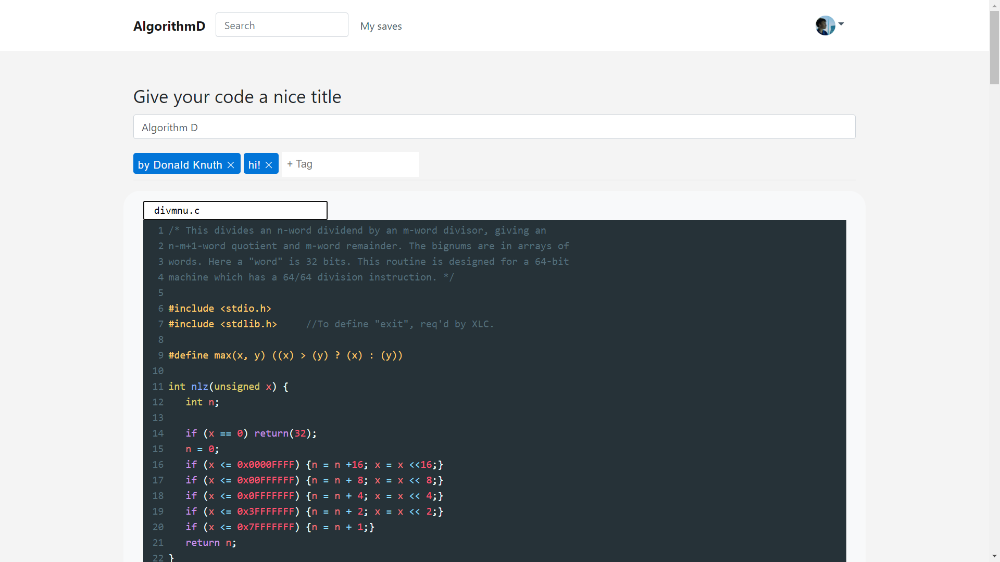

<h1 style="display: inline;">
  AlgorithmD

</h1>

Website for sharing code snippets

 
 

  

 

## What is AlgorithmD

AlgorithmD is a website for sharing snippets of code.

It is named after Donald Knuth's "Algorithm D", that implements division of nonnegative integers ([learn more](https://skanthak.homepage.t-online.de/division.html)).

You can even see an [implementation](https://algorithmd.wlko.me/view/fb792837-c2db-4f80-a002-d0b4801991df) of Algorithm D on AlgorithmD!

## Features
* Built-in code editor that supports all major languages
* Drag-n-drop support
* Snippet tags for grouping
* Search of snippets by title, filename, tags, code or their parts
* Publicly accessible URLs
* Download and copy functionalities

## Goals of this project
The main goal of this project is educational, as countless other alternatives exist ([gist](https://gist.github.com), [pastebin](https://pastebin.com) and many others). While creating this website I got to familiarize myself with such technologies as Angular, Ktor, Google App Engine, Firebase Realtime Database, Auth0 and much more.

## Linked repositories
* Frontend: [waleko/algorithmd](https://github.com/waleko/algorithmd). Built with Angular. Hosted on Cloudflare Pages.
* Backend: [waleko/algorithmd-uploader](https://github.com/waleko/algorithmd-uploader). Written in Kotlin using Ktor. Hosted on Google App Engine.

## Contacts
Questions and suggestions are welcome! Email me [a.kovrigin0@gmail.com](mailto:a.kovrigin0@gmail.com) or telegram me [@waleko](https://t.me/waleko).

## License
AlgorithmD is [Apache 2](./LICENSE) licensed.
